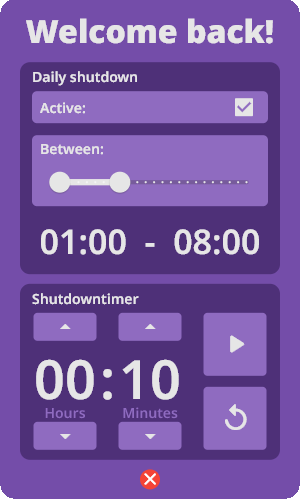

<!-- Improved compatibility of back to top link: See: https://github.com/othneildrew/Best-README-Template/pull/73 -->
<a name="readme-top"></a>
<!--
*** Thanks for checking out the Best-README-Template. If you have a suggestion
*** that would make this better, please fork the repo and create a pull request
*** or simply open an issue with the tag "enhancement".
*** Don't forget to give the project a star!
*** Thanks again! Now go create something AMAZING! :D
-->


<!-- PROJECT SHIELDS -->
<!--
*** I'm using markdown "reference style" links for readability.
*** Reference links are enclosed in brackets [ ] instead of parentheses ( ).
*** See the bottom of this document for the declaration of the reference variables
*** for contributors-url, forks-url, etc. This is an optional, concise syntax you may use.
*** https://www.markdownguide.org/basic-syntax/#reference-style-links
-->


<!-- PROJECT LOGO -->
<br />
<div align="center">
  <a href="https://github.com/HansG9/downshutter">
    
  </a>

<h3 align="center">downshutter</h3>

  <p align="center">
    project_description
    <br />
    <a href="https://github.com/HansG9/downshutter"><strong>Explore the docs »</strong></a>
    <br />
    <br />
    <!--<a href="https://github.com/HansG9/downshutter">View Demo</a>
    ·-->
    <a href="https://github.com/HansG9/downshutter/issues">Report Bug</a>
    ·
    <a href="https://github.com/HansG9/downshutter/issues">Request Feature</a>
  </p>
</div>


<!-- TABLE OF CONTENTS -->
<!--
<details>
  <summary>Table of Contents</summary>
  <ol>
    <li>
      <a href="#about-the-project">About The Project</a>
      <ul>
        <li><a href="#built-with">Built With</a></li>
      </ul>
    </li>
    <li>
      <a href="#getting-started">Getting Started</a>
      <ul>
        <li><a href="#prerequisites">Prerequisites</a></li>
        <li><a href="#installation">Installation</a></li>
      </ul>
    </li>
    <li><a href="#usage">Usage</a></li>
    <li><a href="#roadmap">Roadmap</a></li>
    <li><a href="#contributing">Contributing</a></li>
    <li><a href="#license">License</a></li>
    <li><a href="#contact">Contact</a></li>
    <li><a href="#acknowledgments">Acknowledgments</a></li>
  </ol>
</details>
-->


<!-- ABOUT THE PROJECT -->
## About The Project
<div align="center">
  <a href="https://github.com/HansG9/downshutter">
    
  </a>
</div>
<br />
downshutter is a program used to time shutdowns on your pc

<p align="right">(<a href="#readme-top">back to top</a>)</p>


### Supported Platforms

* []()

<p align="right">(<a href="#readme-top">back to top</a>)</p>


<!-- GETTING STARTED -->
## Getting Started

To get a local copy up and running follow these simple example steps.

### Simple installation

1. [Go to the "downshutter_installer.exe" file](https://github.com/HansG9/downshutter/blob/e05d3736b4967c5511f586afa6d295ff2c6c8809/downshutter_installer.exe)
2. Click on download (right side)
3. Double click on file in downloads folder

### Independent installation

1. [Install Flutter](https://docs.flutter.dev/get-started/install)
2. Clone the repo
   ```sh
   git clone https://github.com/HansG9/downshutter.git
   ```
3. Install packages
   ```sh
   flutter pub get
   ```
3. Build project
   ```sh
   flutter build windows
   ```

<p align="right">(<a href="#readme-top">back to top</a>)</p>


<!-- USAGE EXAMPLES -->
<!--
## Usage

Use this space to show useful examples of how a project can be used. Additional screenshots, code examples and demos work well in this space. You may also link to more resources.

_For more examples, please refer to the [Documentation](https://example.com)_

<p align="right">(<a href="#readme-top">back to top</a>)</p>
-->


<!-- CONTRIBUTING -->
## Contributing

Contributions are what make the open source community such an amazing place to learn, inspire, and create. Any contributions you make are **greatly appreciated**.

If you have a suggestion that would make this better, please fork the repo and create a pull request. You can also simply open an issue with the tag "enhancement".
Don't forget to give the project a star! Thanks again!

1. Fork the Project
2. Create your Feature Branch (`git checkout -b feature/AmazingFeature`)
3. Commit your Changes (`git commit -m 'Add some AmazingFeature'`)
4. Push to the Branch (`git push origin feature/AmazingFeature`)
5. Open a Pull Request

<p align="right">(<a href="#readme-top">back to top</a>)</p>


<!-- LICENSE -->
## License

Distributed under the sd7201 License. See [LICENSE.txt](https://github.com/HansG9/downshutter/blob/main/LICENSE) for more information.

<p align="right">(<a href="#readme-top">back to top</a>)</p>

<!-- ACKNOWLEDGMENTS -->
## This project contains code from:

* Published under the [BSD-3-Clause License](https://opensource.org/license/bsd-3-clause/):
  1. [Flutter](https://github.com/flutter/flutter/tree/master)
  2. [A cron-like time-based job scheduler for Dart](https://pub.dev/packages/cron)
  3. [Shared preferences plugin](https://pub.dev/packages/shared_preferences)
  4. [system_theme](https://pub.dev/packages/system_theme)
  5. [Hold Down Button](https://pub.dev/packages/hold_down_button)

* Published under the [MIT License](https://opensource.org/license/mit/):
  1. [Cupertino Icons](https://pub.dev/packages/cupertino_icons)
  2. [bitsdojo_window](https://pub.dev/packages/bitsdojo_window)
  3. [system_tray](https://pub.dev/packages/system_tray)
  4. [window_manager](https://pub.dev/packages/window_manager)
  5. [flutter_acrylic](https://pub.dev/packages/flutter_acrylic)
  6. [Windows Single Instance](https://pub.dev/packages/windows_single_instance)
  7. [Best-README-Template](https://github.com/othneildrew/Best-README-Template/tree/master)

<p align="right">(<a href="#readme-top">back to top</a>)</p>
